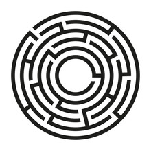

<h1 style="text-align: center">Breakout - Android Game</h1>

---

# Table of Contents

- [Introduction](#introduction)
- [Requirements](#requirements)
- [How To Play](#how-to-play)
- [Image to Scan](#image-to-scan)
- [Screencast](#screencast)
- [Contact](#contact)

 

## Introduction

This project is a well known Breakout game. Which has been developed inside of Unity, with the use of Vuforia Engine. It is a 3D game developed as part of the Gesture Based UI Development module in the Software Development course at the Atlantic Technological University.

 

## Requirements

To open this project in Unity, you will need:

- **Unity** - Version: 2020.3.29f1

 

To play this game on an Android mobile device, you will need:

- **Android** - Version: 8 (API Level 26)

 

## How To Play

There are a few ways in which you will be able to play this game. They are outlined in the [Wiki](https://github.com/Oskar-Ciebien/Gesture_Based_UI_Project/wiki/How-to-Play).

 

## Image to Scan

 

Make sure to use this image, on start-up of the game.

The game will ask you for an image to scan.

 

## Screencast

The screencast of this game is available [here](). It showcases all of the functionalities and gameplay.

 

## Contact

|          | Owen Kelly                                     | Oskar Ciebien                              |
| -------- | ---------------------------------------------- | ------------------------------------------ |
| LinkedIn | https://www.linkedin.com/in/owenkellysoftware/ | https://www.linkedin.com/in/oskar-ciebien/ |
| Email    | G00366614@gmit.ie                              | G00369579@gmit.ie                          |

